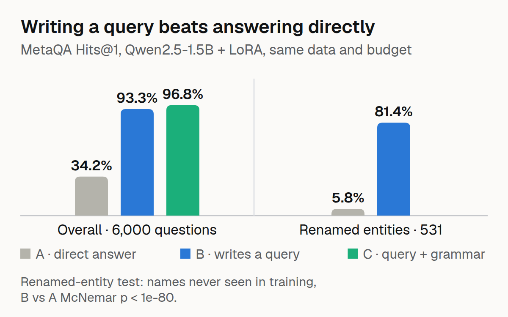

# GraphProof-QA

Small-model question answering that compiles to an executable graph query, with a proof trace for every answer.

A Qwen2.5-1.5B-Instruct model is fine-tuned to translate MetaQA movie questions into a small typed path-query DSL instead of answering directly. Decoding is grammar-constrained to the knowledge-graph schema, the query executes over the graph, and every answer ships with the executed path as its proof.

## Why

Aggregate QA accuracy cannot tell memorisation from grounding. Compile-then-execute separates them:

- **Executable-query rate**: how often the model writes a query that parses and runs
- **Failure breakdown**: entity ambiguity, relation direction, hop count, parse errors
- **Hard conditions**: renamed entities (never seen in training) and deleted triples (the correct answer is "not in the graph")

On an edited graph the executor follows the edit by construction. That is a demonstration, not a discovery; the renamed-entity and deleted-triple results are the real measurements.

## Results

Three systems, same base model, same 30k training pairs, same LoRA config (r=16, 3 epochs). Only the task differs. Evaluation: 2,000 held-out questions per hop level (6,000 total), Hits@1.

| Hop | A: direct answer | B: DSL, unconstrained | C: DSL + grammar |
|---|---|---|---|
| 1-hop | 14.2% | 97.2% | 98.3% |
| 2-hop | 22.2% | 89.7% | 97.2% |
| 3-hop | 66.3% | 93.0% | 94.9% |
| **Overall** | **34.2%** | **93.3%** | **96.8%** |

B vs A: McNemar exact p is effectively 0 (3,645 improvements vs 101 regressions on 6,000 paired items). B produced zero parse failures in 6,000 generations.

**Renamed entities** (200 entities renamed to strings never seen in training, 531 rewritten questions):

| System | Hits@1 |
|---|---|
| B (compile-then-execute) | **81.4%** |
| A (direct answer) | **5.8%** |

A 75.6-point gap, McNemar p < 1e-80 (411 vs 10 discordant pairs; the exact binomial p is ~1.6e-107, the χ² approximation 1.2e-84).

Two more conditions, reported as they came out:

- **Swapped triples** (500 edits): B follows the edit 95.6% of the time. True by construction.
- **Deleted triples** (99 fully disconnected questions): B abstains 8.1%, A 0.0%. Neither abstains well; executability is not calibration.

### Where B fails (100 hand-labelled misses)

| Failure type | Count |
|---|---|
| Wrong relation choice | 83 |
| No exact gold path exists | 17 |
| Parse error | 0 |
| Wrong entity / direction / hop count | 0 |

## What didn't work

- Full entity-trie enforcement distorts greedy entity selection (a tokenisation-vs-trie-path misalignment in the compiled matcher). System C constrains shape and relations instead. Open issue, not a claimed result.
- vLLM was unusable here (flashinfer / CUDA incompatibility); all inference uses HF Transformers.

## Limitations

- MetaQA is template-generated, which flatters every score. 100 paraphrased test questions are in `data/paraphrases/` (generated with gpt-4o-mini, entities preserved); the robustness evaluation on them is still pending.
- Abstention does not work (8.1%).
- One model scale (1.5B); no 7B point.

## Reproduce

Adapters: [raihan-js/graphproof-dsl-1.5b](https://huggingface.co/raihan-js/graphproof-dsl-1.5b), [raihan-js/graphproof-direct-1.5b](https://huggingface.co/raihan-js/graphproof-direct-1.5b). Dataset: [raihan-js/MetaQA-CF](https://huggingface.co/datasets/raihan-js/MetaQA-CF). Per-item results are JSONL logs; every number above comes from them. 26 tests (`PYTHONPATH=src pytest tests/`).

## License

MIT
